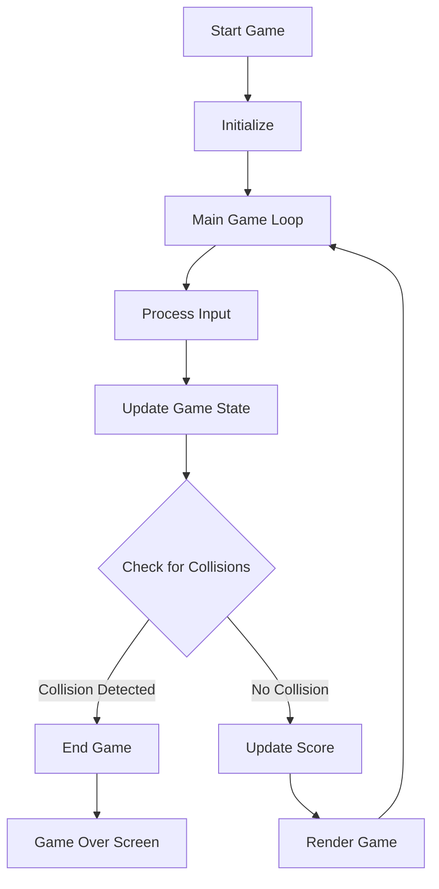

```mermaid
graph TD
    A[Start Game] --> B[Initialize]
    B --> C[Main Game Loop]
    
    C --> D[Process Input]
    D --> E[Update Game State]
    
    E --> F{Check for Collisions}
    F -->|Collision Detected| G[End Game]
    F -->|No Collision| H[Update Score]

    H --> I[Render Game]
    I --> C
    G --> J[Game Over Screen]
```