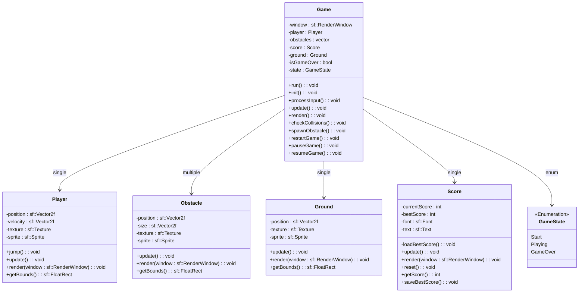

```mermaid
classDiagram
    class Game {
        +run() : void
        -window : sf::RenderWindow
        -player : Player
        -obstacles : vector<Obstacle>
        -score : Score
        -ground : Ground
        -isGameOver : bool
        -state : GameState
        +init() : void
        +processInput() : void
        +update() : void
        +render() : void
        +checkCollisions() : void
        +spawnObstacle() : void
        +restartGame() : void
        +pauseGame() : void
        +resumeGame() : void
    }
    
    class Player {
        -position : sf::Vector2f
        -velocity : sf::Vector2f
        -texture : sf::Texture
        -sprite : sf::Sprite
        +jump() : void
        +update() : void
        +render(window : sf::RenderWindow) : void
        +getBounds() : sf::FloatRect
    }
    
    class Obstacle {
        -position : sf::Vector2f
        -size : sf::Vector2f
        -texture : sf::Texture
        -sprite : sf::Sprite
        +update() : void
        +render(window : sf::RenderWindow) : void
        +getBounds() : sf::FloatRect
    }
    
    class Ground {
        -position : sf::Vector2f
        -texture : sf::Texture
        -sprite : sf::Sprite
        +update() : void
        +render(window : sf::RenderWindow) : void
        +getBounds() : sf::FloatRect
    }
    
    class Score {
        -currentScore : int
        -bestScore : int
        -font : sf::Font
        -text : sf::Text
        -loadBestScore() : void
        +update() : void
        +render(window : sf::RenderWindow) : void
        +reset() : void
        +getScore() : int
        +saveBestScore() : void
    }
    
    class GameState {
        <<Enumeration>>
        Start
        Playing
        GameOver
    }
    
    Game --> Player : single
    Game --> Obstacle : multiple
    Game --> Ground : single
    Game --> Score : single
    Game --> GameState : enum
```