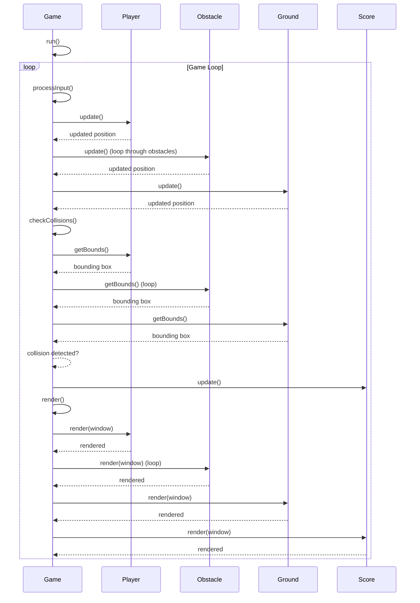

```mermaid
sequenceDiagram
    participant Game
    participant Player
    participant Obstacle
    participant Ground
    participant Score

    Game->>Game: run()
    loop Game Loop
        Game->>Game: processInput()
        Game->>Player: update()
        Player-->>Game: updated position
        
        Game->>Obstacle: update() (loop through obstacles)
        Obstacle-->>Game: updated position

        Game->>Ground: update()
        Ground-->>Game: updated position
        
        Game->>Game: checkCollisions()
        Game->>Player: getBounds()
        Player-->>Game: bounding box
        Game->>Obstacle: getBounds() (loop)
        Obstacle-->>Game: bounding box
        Game->>Ground: getBounds()
        Ground-->>Game: bounding box
        Game-->>Game: collision detected?
        
        Game->>Score: update()
        
        Game->>Game: render()
        Game->>Player: render(window)
        Player-->>Game: rendered
        Game->>Obstacle: render(window) (loop)
        Obstacle-->>Game: rendered
        Game->>Ground: render(window)
        Ground-->>Game: rendered
        Game->>Score: render(window)
        Score-->>Game: rendered
    end
```